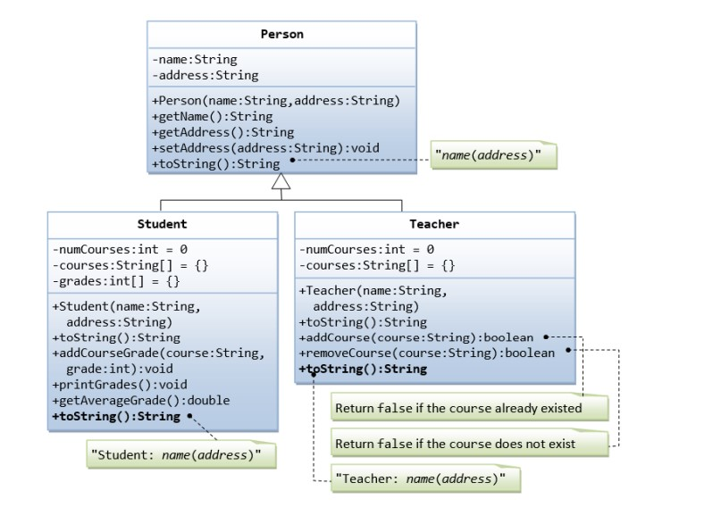

# Task 1. Inheritance: Superclass Person and its Subclasses

Suppose that we are required to model students and teachers in our application.     

Фарз мекунем, ки аз мо талаб карда мешавад, ки дар аризаи худ ба донишҷӯён ва муаллимон намуна шавем.



We can define a superclass called `Person` to store common properties such as name and address,                                  
and subclasses `Student` and `Teacher` for their specific properties.                                

For students, we need to maintain the courses taken and their respective grades.                                                                    

We should be able to add a course with a grade, print all courses taken, and calculate the average grade.                                   

We assume that a student takes no more than 30 courses throughout the program.                                                

For teachers, we need to maintain the courses currently taught and be able to add or remove a course taught.                                     
We assume that a teacher teaches no more than 5 courses concurrently.                                                

---

(Предположим, что нам требуется смоделировать учеников и учителей в нашем приложении.                                                              
Мы можем определить суперкласс с именем `Person` для хранения общих свойств, таких как имя                                    
и адрес, и подклассы `Student` и `Teacher` для их конкретных свойств.                                
                                         
Что касается студентов, нам необходимо сохранить пройденные курсы и их соответствующие оценки.                                                       
Мы должны иметь возможность добавить курс с оценкой, распечатать все пройденные курсы и вычислить средний балл.                                         
Предполагается, что студент проходит не более 30 курсов за всю программу.                                                     

Что касается учителей, нам необходимо поддерживать курсы, которые преподаются в настоящее время,                                         
 и иметь возможность добавлять или удалять преподаваемые курсы.                                            
Предполагается, что преподаватель ведет не более 5 курсов одновременно.)         

(Фарз мекунем, ки мо мехоҳем донишҷӯён ва муаллимонро дар аризаи худ тақлид кунем.
Мо метавонем суперклассеро бо номи "Шахс" муайян кунем, то хосиятҳои умумӣ ба монанди номро нигоҳ дорем
ва суроға ва зерклассҳои `Student` ва `Muallim` барои хосиятҳои хоси онҳо.
                                         
Барои донишҷӯён, мо бояд курсҳои хатмкарда ва баҳои мувофиқи онҳоро нигоҳ дорем.
Мо бояд курсро бо баҳо илова кунем, ҳама курсҳои гирифташударо чоп кунем ва GPA-ро ҳисоб кунем.
Интизор меравад, ки донишҷӯ дар давоми барнома на бештар аз 30 курсро омӯзад.

Дар мавриди муаллимон бошад, мо бояд курсҳоеро, ки ҳоло таълим дода мешаванд, дастгирӣ кунем,
  ва қобилияти илова кардан ё хориҷ кардани курсҳои таълимӣ дошта бошед.
Тахмин меравад, ки муаллим дар як вақт на бештар аз 5 курсро таълим медиҳад.)

## Bird Watcher               
### Instructions                                                         
You're an avid bird watcher that keeps track of how many birds                 
have visited your garden in the last seven days.                       
You have six tasks, all dealing with the numbers of birds that visited your garden.  

Вы заядлый орнитолог, который следит за тем, сколько птиц посетило ваш сад за последние семь дней.                                                                 
У вас есть шесть задач, каждая из которых связана с количеством птиц, посетивших ваш сад  

 шумо паррандапарвари пуртаҷриба ҳастед, ки чанд паррандаро пайгирӣ мекунад
дар хафт рузи охир ба боғи шумо ташриф овардааст.
Шумо шаш вазифа доред, ки ҳама бо шумораи паррандагоне, ки ба боғи шумо ташриф овардаанд, сарукор доранд.


### Task 2. Check what the counts were last week                                                 
For comparison purposes, you always keep a copy of last week's counts nearby, which were:                               
0, 2, 5, 3, 7, 8 and 4. Implement the BirdCount.LastWeek() method that returns last week's counts:  

### Проверьте, какие показатели были на прошлой неделе                                                                
  В целях сравнения вы всегда храните поблизости подсчеты за последнюю неделю, а именно: 0, 2, 5, 3, 7, 8 и 4.                                                         
  Реализуйте метод BirdCount.LastWeek(), который возвращает подсчеты за последнюю неделю: 
  
### Санҷед, ки рақамҳо ҳафтаи гузашта чӣ гуна буданд
Бо мақсади муқоиса, шумо ҳамеша ҳисобҳои ҳафтаи гузаштаро дар наздикӣ нигоҳ медоред, яъне: 0, 2, 5, 3, 7, 8 ва 4.
Татбиқи усули BirdCount.LastWeek(), ки ҳисобро барои ҳафтаи охир бармегардонад:

```csharp
BirdCount.LastWeek();
// => [0, 2, 5, 3, 7, 8, 4]
```
### Task 3. Check how many birds visited today
Implement the BirdCount.Today() method to return how many birds visited your garden                           
today. The bird counts are ordered by day, with the first element being the count of the                          
oldest day, and the last element being today's count.  

###  Проверьте, сколько птиц посетило сегодня                                                                  
  Реализуйте метод BirdCount.Today(), чтобы возвращать количество птиц, посетивших ваш сад сегодня.                                                                 
  Подсчеты птиц упорядочены по дням, при этом первый элемент является подсчетом самого старого дня,                                                      
  а последний элемент - подсчетом за сегодняшний день.

### Санҷед, ки имрӯз чанд парранда диданд
   Методи BirdCount.Today()-ро барои баргардонидани шумораи паррандаҳое, ки имрӯз ба боғи шумо ташриф овардаанд, татбиқ кунед.
   Ҳисобкунии паррандагон аз рӯи рӯз тартиб дода мешавад , элементи якум бо хисоби охирини руз 
   ва элементи охиринро бо хисоби имруз.


```chsarp
int[] birdsPerDay = { 2, 5, 0, 7, 4, 1 };
var birdCount = new BirdCount(birdsPerDay);
birdCount.Today();
// => 1
```

### Task 4. Increment today's count
Implement the BirdCount.IncrementTodaysCount() method to increment today's count:

###  Увеличить сегодняшний счет
Реализуйте метод BirdCount.IncrementTodaysCount() для увеличения сегодняшнего числа:

### Зиёд кардани хисоби имруза.
Методи BirdCount.IncrementTodaysCount() татбик кунед барои зиёд кардани руз.


```csharp 
int[] birdsPerDay = { 2, 5, 0, 7, 4, 1 };
var birdCount = new BirdCount(birdsPerDay);
birdCount.IncrementTodaysCount();
birdCount.Today();
// => 2
```

### Task 5. Check if there was a day with no visiting birds
Implement the BirdCount.HasDayWithoutBirds() method that returns true if there was a day                       
at which zero birds visited the garden; otherwise, return false:    


###  Проверьте, был ли день без прилетающих птиц
Реализовать метод BirdCount.HasDayWithoutBirds(), возвращающий true, если был                                   
день, когда в саду не было ни одной птицы; в противном случае вернуть false:  

### Санҷед, ки оё рӯзе набуд, ки паррандаҳои парвозкунанда набуданд
(Методи BirdCount.HasDayWithoutBirds(), татбик кунед . true бармегардонад ,                                              
агар рузе ки дар боғ ягон паранда набошад. дар акси ҳол false бармегардонад)                                                


```csharp
int[] birdsPerDay = { 2, 5, 0, 7, 4, 1 };
var birdCount = new BirdCount(birdsPerDay);
birdCount.HasDayWithoutBirds();
// => true
```

### Task 6. Calculate the number of visiting birds for the first number of days
Implement the BirdCount.CountForFirstDays() method that returns the number of birds that                     
have visited your garden from the start of the week, but limit the count to the specified                     
number of days from the start of the week. 

###  Подсчитайте количество прилетевших птиц за первое количество дней
Реализуйте метод BirdCount.CountForFirstDays(), который возвращает количество птиц,                 
посетивших ваш сад с начала недели, но ограничивает подсчет указанным                    
количеством дней с начала недели. 

### Шумораи паррандагонро, ки дар рӯзҳои аввал меоянд, ҳисоб кунед
(Методи BirdCount.CountForFirstDays() татбик кунед , микдори парандахоро бармегардонад ,ки нишастаги дар
боғи шумо аз аввал хафта аммо маҳдуд бо хисоби нишондодашудаи микдори руз бо аввали хафта )

```csharp
int[] birdsPerDay = { 2, 5, 0, 7, 4, 1 };
var birdCount = new BirdCount(birdsPerDay);
birdCount.CountForFirstDays(4);
// => 14
```

### Task 7. Calculate the number of busy days
Some days are busier than others. A busy day is one where five or more birds have visited              
your garden. Implement the BirdCount.BusyDays() method to return the number of busy                       
days:

###  Подсчитайте количество загруженных дней
Некоторые дни более загружены, чем другие. Напряженный день — это день, когда                      
пять или более птиц посетили ваш сад. Реализуйте метод BirdCount.BusyDays() для                    
возврата количества загруженных дней:

### Шумораи рӯзҳои серкорро ҳисоб кунед
Баъзе рӯзҳо назар ба дигарон серкортаранд. Рузи серкор рузест, ки
панҷ ё зиёда паррандагон ба боғи шумо ташриф овардаанд. Татбиқи методи BirdCount.BusyDays() барои
шумораи рӯзҳои боршударо баргардонед:

```csharp
int[] birdsPerDay = { 2, 5, 0, 7, 4, 1 };
var birdCount = new BirdCount(birdsPerDay);
birdCount.BusyDays();
// => 2
```
